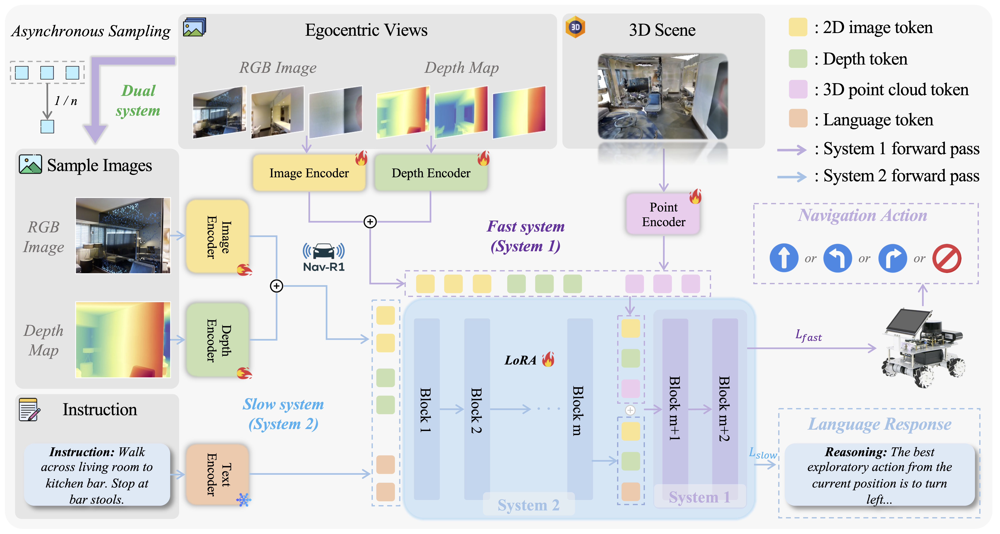

#  Nav-R1: Reasoning and Navigation in Embodied Scenes

This is the official repository for the paper:
> **Nav-R1: Reasoning and Navigation in Embodied Scenes**
>
> [Qingxiang Liu](*)\*, [Ting Huang](https://github.com/Believeht029)\*, [Zeyu Zhang](https://steve-zeyu-zhang.github.io/)\*<sup>†</sup>, and [Hao Tang](https://ha0tang.github.io/)<sup>#</sup>
>
> \*Equal contribution. <sup>†</sup>Project lead. <sup>#</sup>Corresponding author.
>
> ### [Paper]() | [Website](https://aigeeksgroup.github.io/Nav-R1/) | [Data](https://huggingface.co/datasets/AIGeeksGroup/Nav-CoT-110K) | [Models](*) | [HF Paper](*)


## ✏️ Citation
If you find our code or paper helpful, please consider starring ⭐ us and citing:
```bibtex

```

## 🏃 Intro Nav-R1
Nav-R1 is an embodied foundation model that integrates dialogue, reasoning, planning, and navigation capabilities to enable intelligent interaction and task execution in 3D environments.

Embodied navigation requires agents to integrate perception, reasoning, and action for robust interaction in complex 3D environments. Existing approaches often suffer from incoherent and unstable reasoning traces that hinder generalization across diverse environments, and difficulty balancing long-horizon semantic reasoning with low-latency control for real-time navigation. To address these challenges, we propose **Nav-R1**, an embodied foundation model that unifies reasoning in embodied environments. We first construct Nav-CoT-110K, a large-scale dataset of step-by-step Chains-of-Thought (CoT) for embodied tasks, which enables cold-start initialization with structured reasoning. Building on this foundation, we design a GRPO-based reinforcement learning framework with three complementary rewards: format, understanding, and navigation, to improve structural adherence, semantic grounding, and path fidelity. Furthermore, we introduce a Fast-in-Slow reasoning paradigm, decoupling deliberate semantic reasoning from low-latency reactive control for efficient yet coherent navigation. Extensive evaluations on embodied AI benchmarks demonstrate that Nav-R1 consistently outperforms strong baselines, with over 8\% average improvement in reasoning and navigation performance. Real-world deployment on a mobile robot further validates its robustness under limited onboard resources.



## TODO List

- [x] Release Nav-CoT-110K dataset. (see [Nav-CoT-110K](https://huggingface.co/datasets/AIGeeksGroup/Nav-CoT-110K))
- [ ] Upload our paper to arXiv and build project pages.
- [ ] Upload the code.
- [ ] Add a demo on huggingface.


## 👩🏻‍💻 Case Study

### Real-World

### Simulator

## 🌟 Star History

[](https://www.star-history.com/#AIGeeksGroup/Nav-R1&Date)

## 😘 Acknowledgement

We thank the authors of [3D-R1](https://github.com/AIGeeksGroup/3D-R1), [DeepSeek-Math](https://github.com/deepseek-ai/DeepSeek-Math), and [Habitat-Lab](https://github.com/facebookresearch/habitat-lab) for their open-source code.