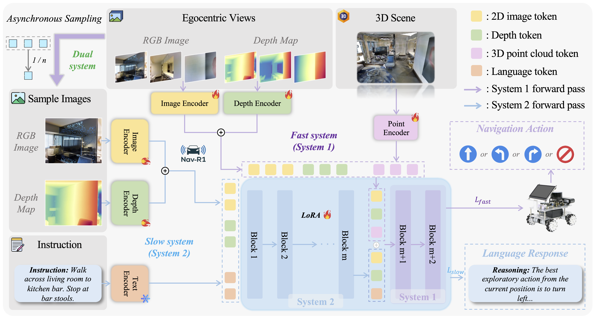

#  Nav-R1: Reasoning and Navigation in Embodied Scenes

This is the official repository for the paper:
> **Nav-R1: Reasoning and Navigation in Embodied Scenes**
>
> [Qingxiang Liu](https://github.com/AMXalice)\*, [Ting Huang](https://github.com/Believeht029)\*, [Zeyu Zhang](https://steve-zeyu-zhang.github.io/)\*<sup>†</sup>, and [Hao Tang](https://ha0tang.github.io/)<sup>#</sup>
>
> \*Equal contribution. <sup>†</sup>Project lead. <sup>#</sup>Corresponding author.
>
> ### [Paper](https://arxiv.org/abs/2509.10884) | [Website](https://aigeeksgroup.github.io/Nav-R1/) | [Data](https://huggingface.co/datasets/AIGeeksGroup/Nav-CoT-110K) | [Models](https://huggingface.co/AIGeeksGroup/Nav-R1) | [HF Paper](https://huggingface.co/papers/2509.10884)


https://github.com/user-attachments/assets/5eeb0e07-d5ea-483a-872c-b15f48838daa


## ✏️ Citation
If you find our code or paper helpful, please consider starring ⭐ us and citing:
```bibtex
@article{liu2025navr1,
  title={Nav-R1: Reasoning and Navigation in Embodied Scenes},
  author={Liu, Qingxiang and Huang, Ting and Zhang, Zeyu and Tang, Hao},
  journal={arXiv preprint arXiv:2509.10884},
  year={2025}
}

```

## 🏃 Intro Nav-R1
Nav-R1 is an embodied foundation model that integrates dialogue, reasoning, planning, and navigation capabilities to enable intelligent interaction and task execution in 3D environments.

Embodied navigation requires agents to integrate perception, reasoning, and action for robust interaction in complex 3D environments. Existing approaches often suffer from incoherent and unstable reasoning traces that hinder generalization across diverse environments, and difficulty balancing long-horizon semantic reasoning with low-latency control for real-time navigation. To address these challenges, we propose **Nav-R1**, an embodied foundation model that unifies reasoning in embodied environments. We first construct Nav-CoT-110K, a large-scale dataset of step-by-step Chains-of-Thought (CoT) for embodied tasks, which enables cold-start initialization with structured reasoning. Building on this foundation, we design a GRPO-based reinforcement learning framework with three complementary rewards: format, understanding, and navigation, to improve structural adherence, semantic grounding, and path fidelity. Furthermore, we introduce a Fast-in-Slow reasoning paradigm, decoupling deliberate semantic reasoning from low-latency reactive control for efficient yet coherent navigation. Extensive evaluations on embodied AI benchmarks demonstrate that Nav-R1 consistently outperforms strong baselines, with over 8\% average improvement in reasoning and navigation performance. Real-world deployment on a mobile robot further validates its robustness under limited onboard resources.



## TODO List

- [x] Release Nav-CoT-110K dataset. (see [Nav-CoT-110K](https://huggingface.co/datasets/AIGeeksGroup/Nav-CoT-110K))
- [x] Upload our paper to arXiv and build project pages.
- [x] Upload the code.
- [ ] Add a demo on huggingface.

##  YouTube Video

>[!NOTE]
> If you’d like to learn more about our paper, be sure to check out this [**youtube video**](https://youtu.be/JL7MCNHeor0) by @AIResearchRoundup.

[](https://youtu.be/JL7MCNHeor0)

## 🚀 Quickstart

### Environment

```bash
conda create -n navr1 python=3.10 -y
conda activate navr1
pip install -r requirements.txt
# Install Habitat-Lab and Habitat-Sim per official instructions for your OS/CUDA
```

### Dataset
- You can download the `Nav-CoT-110K` from [huggingface](https://huggingface.co/datasets/AIGeeksGroup/Nav-CoT-110K) and set `dataset.path` to a folder containing `train.jsonl`, `val.jsonl`, `test.jsonl` with fields: `instruction`, `history_images`, `action_space`, `target`.

Update `navr1/configs/default.yaml` or pass `--config` to scripts.

### Train

```bash
python train.py --config navr1/configs/default.yaml --workdir runs/navr1
```

### Evaluate

```bash
python evaluate.py --config navr1/configs/default.yaml --split val --episodes 50
```

### Notes
- Habitat-Lab Simulator is the sole supported simulation backend. Please ensure habitat-lab and habitat-sim are correctly installed, and that `simulator.habitat_config` points to your task YAML (such as VLN R2R or ObjectNav HM3D).
  
## 👩🏻‍💻 Case Study

### Real-World
*Start from the beginning, walk to the side table on your right and pause there. Then go straight towards the front-left and stop at the wall.*

<video src="https://github.com/user-attachments/assets/e68b95fb-877c-4baf-81e3-08642896004e"  controls style="max-width:100%;"></video>

### Simulator
*Search for a chair.*

<video src="https://github.com/user-attachments/assets/6ca5b560-e3ad-4f14-a74f-15fb71f4c415" controls style="max-width:100%;"></video>

## 🌟 Star History

[](https://www.star-history.com/#AIGeeksGroup/Nav-R1&Date)

## 😘 Acknowledgement

We thank the authors of [3D-R1](https://github.com/AIGeeksGroup/3D-R1), [DeepSeek-Math](https://github.com/deepseek-ai/DeepSeek-Math), and [Habitat-Lab](https://github.com/facebookresearch/habitat-lab) for their open-source code.
